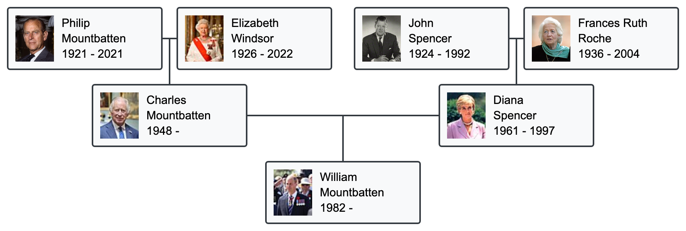

# PHP Family Tree
I was looking for a library to draw a very simple family tree in a webpage, but I found only complicated Javascript frameworks, so I decided to write it myself and to release it publicly. Maybe this is what you need, who knows.

The PHP code generates an SVG image that represent the ancestors of one child for a chosen number of generations. The style is highly customizable: you can modify the dimensions, the distances, and the colors.



## Guide
Include [familytreelib.php](familytreelib.php) to your project, set the number of ancestors' generations you want (`gen`), and start to program.
```php
include("familytreelib.php");
```

The variables written at the beginning of this file can be modified according to your needs. You can custom the node dimensions (`node_width` and `node_height`), the margins of the whole image (`marginx` and `marginy`), the lenght of the vertical lines connecting generations (`vline`) and, just for the oldest generation, the lenght of the horizontal line connecting husband and wife (`hline1`) and the size of the gap separating couples (`gap1`).

The family tree style is defined in [style.css](style.css). Change it as well, if you like.

### Image size
Compute the final image size with:
```php
$tot_width = get_tot_width($node_width, $hline1, $gap1, $marginx, $gen);
$tot_height = get_tot_height($node_height, $vline, $marginy, $gen);
```

### Building the basic elements
One person is represented by an array:
```php
$p = array(
  "first_name" => "Elizabeth",
  "family_name" => "Windsor",
  "birthdate" => 1926,
  "deathdate" => 2022,
  "img" => "https://upload.wikimedia.org/wikipedia/commons/thumb/b/b2/Queen_Elizabeth_II_of_New_Zealand.jpg/50px-Queen_Elizabeth_II_of_New_Zealand.jpg",
);
```

To draw one node:
```php
draw_node($offsetx, $offsety, $node_width, $node_height, $p);
```
where `offsetx` and `offsety` represent the positions of the nodes (the coordinates of the upper left corner).

To draw one couple with the two lines connecting them to one child:
```php
draw_couple($offsetx, $offsety, $node_width, $node_height, $hline, $vline, $p_father, $p_mother);
```

### Building the entire tree
The most difficult thing to do for a family tree is defining the positions of the nodes, the lenghts of the connecting lines and the gaps. It must be done for each generation in a generic way, once the other parameters have been set.

Once the values for the generation have been set, the difference between the horizontal coordinates of two couples is computed simply as `$node_width * 2 + $hline + $gap`.

#### From the top
Having defined the position of the the highest generation (the oldest one), the values for the next generations are:
```php
$offsetx += $hline / 2 + $node_width / 2;
$offsety += $vline + $node_height / 2;
```

The horizontal line and the gap for the next generations are:
```php
$hline += $gap + $node_width;
$gap = $hline;
```

[example_top.php](example_top.php) describes a family tree built from the top.

#### From the bottom
If you want to build the tree from the bottom, I suggest you to compute the horizontal lines and the gaps before starting drawing the ancestors, since their values depend on the oldest generation (the last generation if you start from the bottom). The coordinates of the couples can be computed while drawing them, as in the other approach, but with the minus instead of the plus.

[example_bottom.php](example_bottom.php) describes a family tree built from the bottom.

## Contributing
Contributions are most welcome by forking the repository and sending a pull request.
